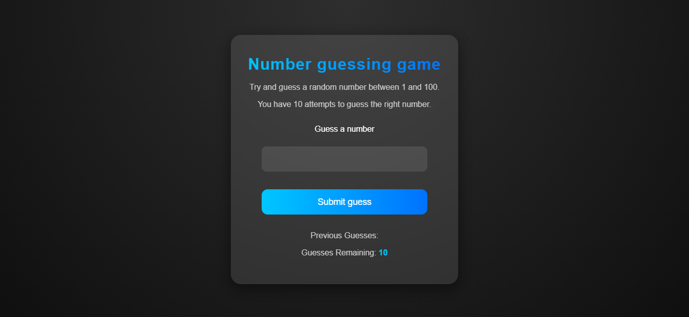

# 🎯 Number Guessing Game

A fun and interactive **JavaScript Number Guessing Game** where players try to guess a randomly generated number between **1 and 100** within 10 attempts.  
Built using **HTML, CSS, and Vanilla JavaScript** as part of my **6-month reskilling journey** to strengthen core frontend and logic-building skills.

---

## 🖼️ Preview  

---

## 📌 About  
- 🔢 Random number is generated between **1–100**  
- 🧠 Player gets **10 chances** to guess the correct number  
- 💬 Provides instant feedback — *Too High*, *Too Low*, or *Correct!*  
- 🔁 Offers option to **restart the game** after completion  
- ⚡ Built using **pure JavaScript** (no frameworks)

---

## 🧠 Tech Stack  
- **HTML5** – Structure  
- **CSS3** – Styling  
- **JavaScript (ES6)** – Game logic and interactivity  